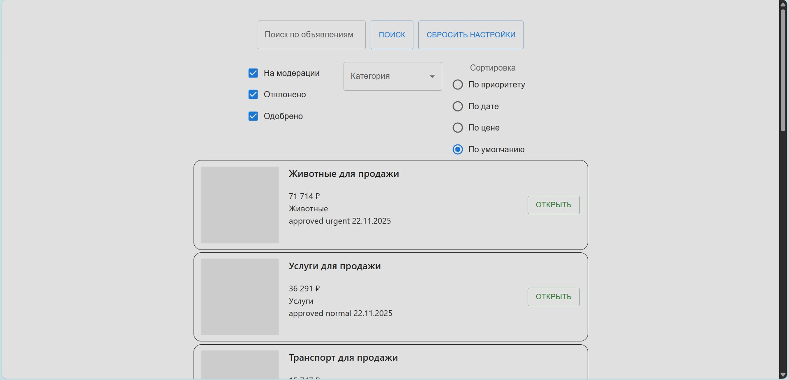
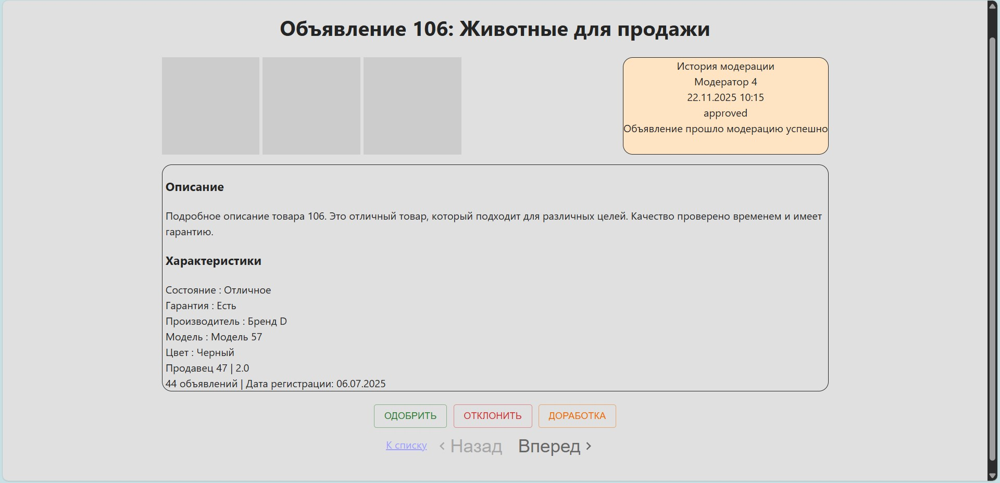
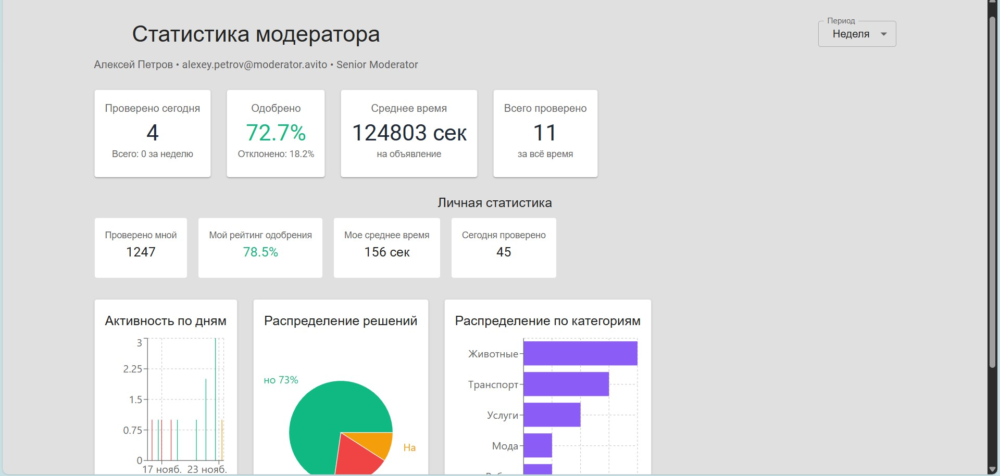

# 🚀 Система модерации объявлений Avito

<div align="center">


**Веб-приложение для эффективной модерации объявлений на платформе Avito**

[Функциональность](#-функциональность) • [Установка](#-установка) • [Запуск](#-запуск) • [Технологии](#-технологии)

</div>

## 📋 Оглавление

- [Обзор](#-обзор)
- [Функциональность](#-функциональность)
- [Скриншоты](#-скриншоты)
- [Установка](#-установка)
- [Запуск](#-запуск)
- [Технологии](#-технологии)
- [Архитектура](#-архитектура)
- [API Документация](#-api-документация)

## 🎯 Обзор

Это современное веб-приложение для модерации объявлений, разработанное для внутреннего использования модераторами платформы Avito. Система обеспечивает быструю проверку, сортировку и управление тысячами ежедневных объявлений с интуитивно понятным интерфейсом и расширенной статистикой.

## ✨ Функциональность

### 📱 Главная страница - Список объявлений (`/list`)
- **Карточки объявлений** с полной информацией
- **Расширенные фильтры**:
  - По статусу (множественный выбор)
  - По категориям
  - По диапазону цен
  - Поиск по названию
- **Сортировка** по дате, цене, приоритету
- **Пагинация** по 10 объявлений на страницу
- **Быстрый сброс** фильтров

### 🔍 Детальная страница объявления (`/item/:id`)
- **Галерея изображений** (3+ фото)
- **Полная информация** о товаре и продавце
- **История модерации** с комментариями
- **Быстрая навигация** между объявлениями
- **Панель модерации**:
  - ✅ Одобрить
  - ❌ Отклонить (с указанием причины)
  - ⚠️ Вернуть на доработку

### 📊 Статистика модератора (`/stats`)
- **Ключевые метрики** эффективности
- **Интерактивные графики**:
  - Активность по дням (столбчатая диаграмма)
  - Распределение решений (круговая диаграмма)
  - Статистика по категориям
- **Персональная статистика** модератора
- **Фильтрация по периодам** (день/неделя/месяц)

## 🖼️ Скриншоты

### 📱 Главная страница - Список объявлений


### 🔍 Детальная страница объявления


### 📊 Страница статистики


## 🛠️ Установка

### Предварительные требования

- **Node.js** версии 20.0 или выше
- **npm** или **yarn**

### Клонирование репозитория

```bash
git clone https://github.com/PigerVegetabilis/avito-tech-test-project.git
cd avito-tech-test-project
```

### Установка зависимостей

```bash
# Установка зависимостей для клиента
npm install

# Установка зависимостей для сервера
cd /tech-init3-server
npm install
```

## 🚀 Запуск

### Локальная разработка

#### Запуск сервера (порт 3001)
```bash
cd /tech-init3-server
npm run dev
```

#### Запуск клиента (порт 3000)
```bash
cd ..
npm run dev
```

### Production сборка

```bash
# Сборка клиента
npm run build

# Запуск сервера
cd ../tech-init3-server
npm start
```

### Docker запуск

```bash
# Запуск всего приложения
docker-compose up --build

# Только в фоновом режиме
docker-compose up -d
```

## 🏗️ Технологии

### Основной стек
- **Frontend**: React 18.2, TypeScript, React Router DOM
- **Backend**: Node.js, Express.js
- **UI Библиотека**: Material-UI (MUI) v5
- **Графики**: Recharts
- **HTTP Клиент**: Axios

### Дополнительные технологии
- **Стилизация**: CSS Modules, Emotion
- **Инструменты разработки**: ESLint, Prettier
- **Контейнеризация**: Docker, Docker Compose

### Основные endpoints

#### Объявления
- `GET /api/v1/ads` - Список объявлений с фильтрацией
- `GET /api/v1/ads/:id` - Детальная информация об объявлении
- `POST /api/v1/ads/:id/approve` - Одобрить объявление
- `POST /api/v1/ads/:id/reject` - Отклонить объявление
- `POST /api/v1/ads/:id/request-changes` - Вернуть на доработку

#### Статистика
- `GET /api/v1/stats/summary` - Общая статистика
- `GET /api/v1/stats/chart/activity` - Данные для графика активности
- `GET /api/v1/stats/chart/decisions` - Распределение решений
- `GET /api/v1/stats/chart/categories` - Статистика по категориям

#### Модераторы
- `GET /api/v1/moderators/me` - Информация о текущем модераторе

## 🎯 Обоснование выбора технологий

### Material-UI (MUI)
- **Готовая дизайн-система** для быстрой разработки
- **Доступность** из коробки
- **Отзывчивые design** компоненты
- **TypeScript поддержка**
- **Большое сообщество** и документация

### TypeScript
- **Статическая типизация** для надежности кода
- **Лучшая поддержка IDE** и автодополнение
- **Раннее обнаружение ошибок**
- **Улучшенная рефакторинга**

### Recharts
- **Простота использования** с React
- **Высокая производительность**
- **Кастомизируемость**
- **TypeScript поддержка**

### Docker
- **Изоляция окружения**
- **Простота развертывания**
- **Консистентность** между средами
- **Масштабируемость**

## 📄 Лицензия

Этот проект разработан в рамках тестового задания для Avito.

---

<div align="center">

**Разработано с ❤️ для эффективной модерации**

*Для вопросов и предложений: [paveleagle2005@gmail.com](mailto:paveleagle2005@gmail.com)*

</div>